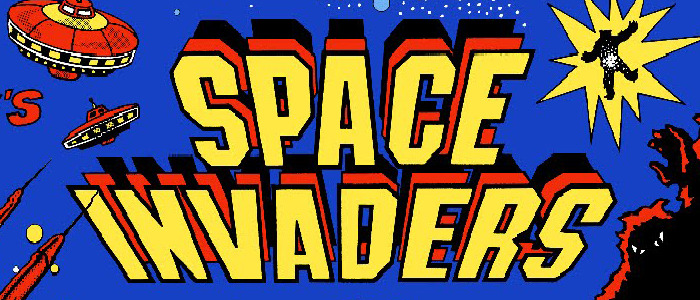

# Space Invaders Clone

Recreated basic game experience with use of advanced Unity features and top notch software design patterns.

## Features

	- Project for Android platform
	- Data and asset initialization at start
	- High Scores - list of the top 10 scores (locally)
	- Enemies come in waves indefinitely (each wave faster movement)
	- After hit, player becomes invulnerable for few seconds
	- Gameplay related constants stored in Scriptable Object
	- Unity.Addressables for asset management
	- Use of a finite state machine (FSM) and dependency injection (DI)

**Unity 2020.3.22f1 LTS**

